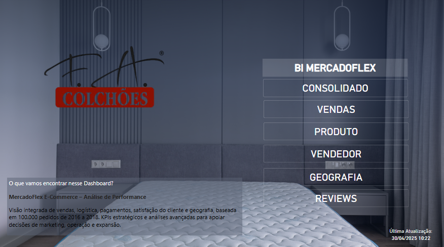
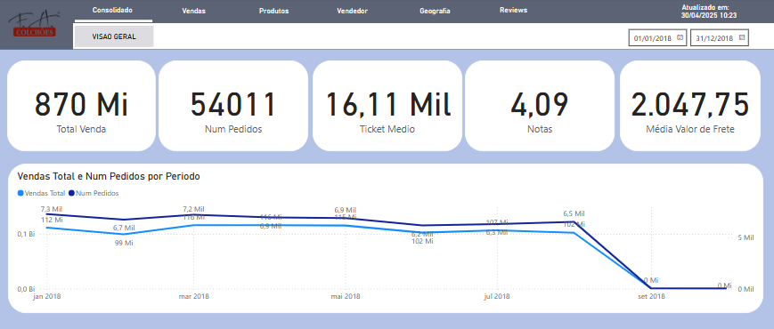
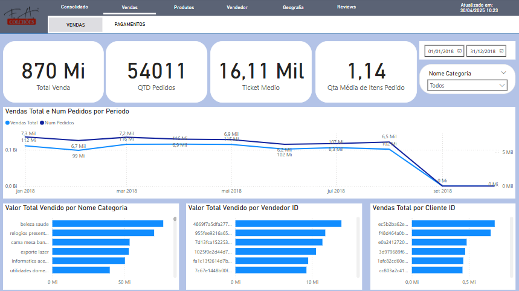
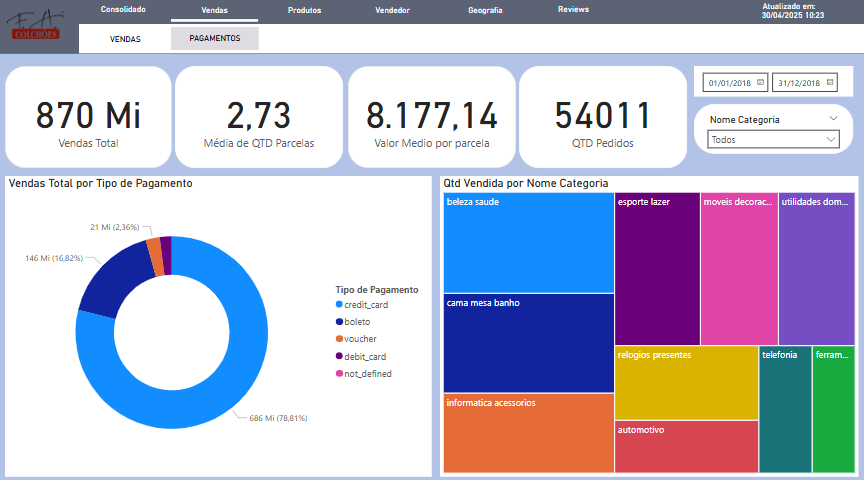
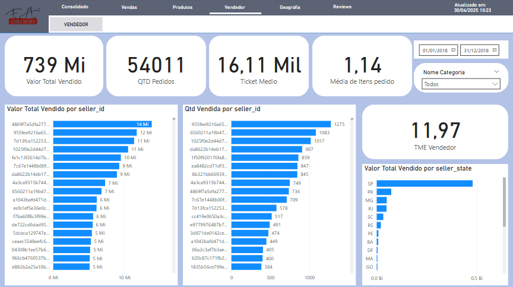
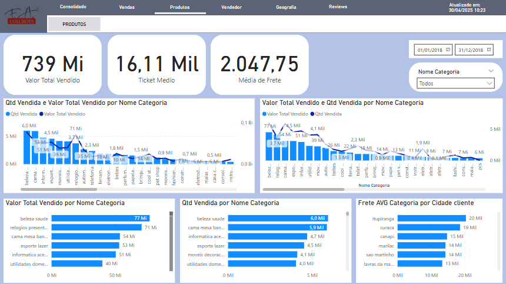
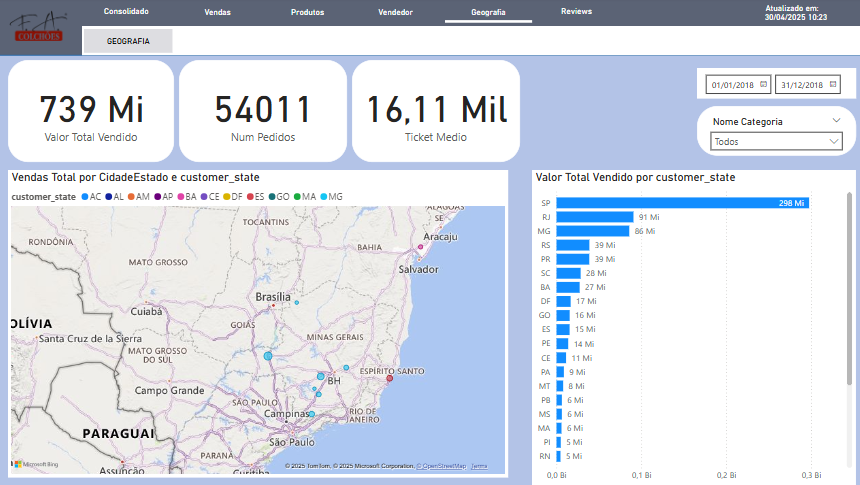
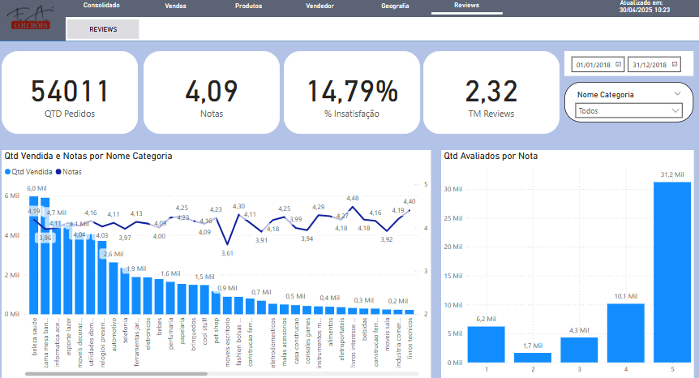

# 📊 MercadoFlex E-Commerce — Dashboard de BI (Power BI)

Este projeto de Business Intelligence foi desenvolvido para a empresa **MercadoFlex**, um e-commerce brasileiro que comercializa eletrônicos e produtos para casa. O objetivo é monitorar e analisar indicadores estratégicos das áreas de **vendas, logística, pagamentos e satisfação do cliente** por meio de um painel interativo no Power BI.

---

## 📁 Base de Dados

A análise é baseada em 100 mil pedidos realizados entre 2016 e 2018, organizados em 9 arquivos CSV:

| Arquivo                           | Conteúdo Principal                            |
|----------------------------------|-----------------------------------------------|
| `orders_dataset`                 | Pedidos (status, datas, estimativas)          |
| `order_items_dataset`            | Itens de pedido (produto, preço, frete)       |
| `order_payments_dataset`         | Tipos, parcelas e valores de pagamento        |
| `order_reviews_dataset`          | Notas e comentários dos clientes              |
| `customers_dataset`              | Dados e localização dos clientes              |
| `sellers_dataset`                | Dados e localização dos vendedores            |
| `products_dataset`               | Atributos dos produtos                        |
| `geolocation_dataset`            | Latitude/Longitude por CEP                    |
| `product_category_name_translation` | Tradução de categorias de produto          |

---

## 🧩 Modelagem de Dados

- Modelo Estrela com `order_items_dataset` como fato principal.
- Relacionamentos via `order_id`, `customer_id`, `product_id` e `seller_id`.
- Tabela calendário com hierarquias e flags de tempo (mês, ano, fim de semana, etc.).
- Criação de medida com data/hora da última atualização do BI.
- Solução para unir múltiplas medidas em uma tabela de medidas DAX.

---

## 📊 Indicadores e Métricas

### 📌 Visão Geral
- Receita Total
- Total de Pedidos
- Ticket Médio
- Quantidade Média de Itens por Pedido
- Última Atualização do BI

### 🗓️ Análise Temporal
- Evolução mensal de pedidos e receita
- Sazonalidade por mês e dia da semana

### 📦 Produtos e Categorias
- Top 10 produtos e categorias por receita e volume
- Ticket Médio por Categoria
- Frete Médio por Categoria

### 🛍️ Vendedores
- Receita e número de pedidos por vendedor
- Tempo médio de envio por seller (com exibição "X dias")

### 🌍 Geografia de Vendas
- Mapa de calor por cidade ou estado do cliente
- Visual baseado em dados de geolocalização ou nome de local

### 💳 Comportamento de Pagamento
- Distribuição por tipo de pagamento
- Valor médio por parcela
- Quantidade média de parcelas

### 🌟 Qualidade e Satisfação
- Média de review score (geral e por categoria)
- % de reviews negativas (score ≤ 2)
- Tempo médio de resposta a reviews

### 🔁 Clientes e Fidelização
- Identificação de clientes recorrentes
- Recência de compra
- Potencial de cálculo de LTV (Lifetime Value)

### 🕒 Logística
- Detecção de categorias com maiores atrasos de entrega
  (baseado na diferença entre data estimada e data real)

---

## 🔧 Funcionalidades Extras

- Nomes de produtos com formatação amigável (ex: “escova_de_dente” → “escova de dente”)
- Filtros com **pesquisa por texto** para facilitar a navegação
- Nomes aleatórios simulados para clientes e vendedores
- Soluções para ajustes de relacionamento indireto entre tabelas com ponte
- Visual de **treemap** com produtos mais vendidos
- Indicador de **tempo médio de envio** convertido em string com sufixo “dias”

---

## 📤 Entregáveis

- Arquivo `.pbix` com:
  - Página “Visão Geral” com KPIs principais
  - Páginas temáticas: Vendas, Produtos, Vendedores, Geografia, Reviews
  
  
  
  
  
  
  
  
- Modelo relacional e medidas organizadas
- Visuais interativos com filtros, drill-down e gráficos claros

---

## ✅ Conclusão

Este dashboard fornece uma visão estratégica completa da operação do e-commerce MercadoFlex. A solução permite decisões orientadas por dados sobre marketing, logística, atendimento ao cliente e performance comercial.

---